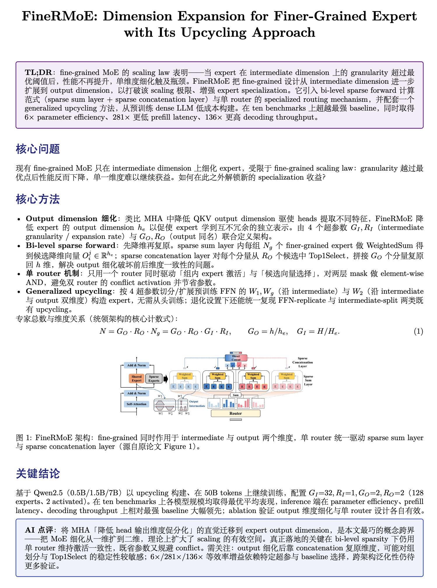

# Zotero Paper Summary

给支持 skill 的 AI agent 一个 Zotero Better BibTeX citation key，自动读取论文、生成中文解读 PDF，并把报告作为附件挂回原论文条目。

```text
citekey  ->  定位 Zotero 中的原论文 PDF  ->  生成解读 PDF  ->  通过 Zotero 10 Local API 挂载
```



本仓库面向 **Zotero 10**。附件写入直接使用 Zotero 10 自带的 [authenticated Local API](https://www.zotero.org/support/dev/web_api/v3/local_api)，不再需要 Paper Summary Bridge 或其它自定义 bridge 插件，也不会直接修改 Zotero 数据库。Better BibTeX 仍是必需插件，用于把 citation key 精确解析为论文附件。

## 仓库结构

```text
Zotero-Vibe-Summary/
├── skill/
│   ├── SKILL.md                       # 工作流与解读 PDF 规范
│   ├── assets/paper_style.tex         # LaTeX 样式模板
│   └── scripts/zotero_local_attach.py # Zotero 10 Local API 上传器
├── asserts/demo.png                   # 输出示例
└── README.md
```

## 依赖

以下依赖都是 skill 完整运行所需的依赖；仓库内的上传器本身只使用 Python 标准库。

| 依赖 | 要求 | 用途 |
|---|---|---|
| [Zotero](https://www.zotero.org/download/) | **10.x**，运行过程中保持开启 | 提供本地文献库和 authenticated Local API |
| [Better BibTeX for Zotero](https://retorque.re/zotero-better-bibtex/installation/) | 安装与 Zotero 10 兼容的版本 | 通过 [JSON-RPC](https://retorque.re/zotero-better-bibtex/exporting/json-rpc/) 的 `item.attachments(citekey)` 定位原 PDF |
| 支持本地 skill 的 AI agent | 推荐 Codex；也可使用兼容 `SKILL.md` 的 agent | 执行解析、阅读、写作、编译和挂载流程 |
| Python | **3.9+** | 运行 `zotero_local_attach.py`；上传器无第三方 Python 依赖 |
| [PyMuPDF](https://pymupdf.readthedocs.io/) | 可导入为 `fitz` | 提取 PDF 文本、裁取论文主图和渲染检查 |
| TeX Live / MacTeX / MiKTeX | 必须提供 `xelatex`、`ctex` 和下列 LaTeX 宏包 | 生成中文 PDF |
| `curl` | 任意近期版本 | 调用 Better BibTeX JSON-RPC |

LaTeX 模板会用到这些包：`ctex`、`amsmath`、`amssymb`、`amsthm`、`mathtools`、`bm`、`graphicx`、`booktabs`、`array`、`multirow`、`makecell`、`xcolor`、`geometry`、`enumitem`、`tcolorbox`、`titlesec`、`hyperref` 和 `float`。安装完整 TeX Live/MacTeX 通常会一次提供它们；精简发行版需要另行安装缺失包。

安装 Python 依赖：

```bash
python3 -m pip install pymupdf
```

安装后可快速检查：

```bash
python3 --version
python3 -c 'import fitz; print(fitz.__version__)'
xelatex --version
curl --version
```

## 安装

### 1. 配置 Zotero 10

1. 启动 Zotero 10。
2. 在 Zotero「设置 → Advanced」中启用 **Allow other applications on this computer to communicate with Zotero**。
3. 安装 Better BibTeX，并确认目标论文已有 citation key 和本地 PDF 附件。

不需要安装本仓库自己的 Zotero 插件。如果曾安装旧版 **Paper Summary Bridge**，请在 Zotero 的「工具 → 插件」中卸载；新版 skill 已完全替代它。

### 2. 安装 skill

Codex：

```bash
mkdir -p ~/.codex/skills/paper-summary
cp -R skill/. ~/.codex/skills/paper-summary/
```

Claude Code 等兼容本地 skill 的 agent，可把 `skill/` 的内容复制到其对应的 `paper-summary` skill 目录。例如：

```bash
mkdir -p ~/.claude/skills/paper-summary
cp -R skill/. ~/.claude/skills/paper-summary/
```

修改仓库里的 skill 后，需要重新复制；开发时也可以按 agent 的要求建立软链接。

### 3. 验证 Zotero 与 Better BibTeX

Zotero Local API：

```bash
curl -s -D - http://127.0.0.1:23119/api/ -o /dev/null
```

响应头应包含 `Zotero-Server-ID` 和以 `10.` 开头的 `X-Zotero-Version`。如果返回 `403`，请重新检查 Zotero 的 Local API 设置。

Better BibTeX JSON-RPC：

```bash
curl -s -X POST http://127.0.0.1:23119/better-bibtex/json-rpc \
  -H 'Content-Type: application/json' \
  -d '{"jsonrpc":"2.0","method":"api.ready","params":[],"id":1}'
```

响应中应包含 Zotero 和 Better BibTeX 的版本。

## 使用

在 agent 中提供 citation key：

- `解读 suAttentionSinkTransformers2026`：默认生成约 2 页的简短版，并优先包含一张主图。
- `详细解读 suAttentionSinkTransformers2026`：生成逐章节、图文并茂的详细版。

| 模式 | 触发方式 | 输出文件名 |
|---|---|---|
| 简短版（默认） | 未明确要求详细解读 | `<论文标题>_brief.pdf` |
| 详细版 | 明确要求“详细”“完整”或“图文并茂” | `<论文标题>.pdf` |

完整的写作、排版、截图、验证和清理规范见 [`skill/SKILL.md`](skill/SKILL.md)。

## Zotero 10 授权与上传

第一次写入时，Zotero 会显示授权对话框：

- `Allow`：一次性授权。上传包含多个写请求，因此 Zotero 可能再次询问。
- `Always Allow`：允许后续写入复用同一个 Local API key；可随时在 Zotero Advanced 设置中用 **Clear Write Authorizations** 撤销。
- `Deny`：停止挂载，生成的临时报告会保留，便于手动处理。

在 macOS 上，skill 会把 `Always Allow` 返回的 key 保存到系统 Keychain，service 为 `org.openai.codex.paper-summary.zotero-local-api`，不会把 key 写入仓库、普通文件、命令行或日志。Windows/Linux 上上传流程同样可用，但当前脚本不跨进程保存 key；新进程可能再次触发 Zotero 授权。高级用户也可通过进程级环境变量 `ZOTERO_LOCAL_API_KEY` 显式提供 key。

macOS 上可只读检查持久授权是否可用：

```bash
python3 skill/scripts/zotero_local_attach.py --credential-status
```

该检查不会申请授权，也不会修改 Zotero 条目或显示 key。

上传器的完整调用方式：

```bash
python3 skill/scripts/zotero_local_attach.py \
  --source-attachment-key NZ5LELWY \
  --file "/absolute/path/to/report.pdf" \
  --title "AI 解读报告 - 论文标题"
```

脚本会依次创建 `imported_file` 子附件、上传完整 PDF、注册上传，并重新读取附件和 storage 文件校验 parent、字段、文件大小与 MD5。只有全部验证通过才会返回 `"ok": true`。

## 常见问题

- **无法连接 `127.0.0.1:23119`**：确认 Zotero 正在运行。
- **Local API 返回 `403`**：在 Zotero Advanced 设置中启用本地通信。
- **提示需要 Zotero 10+**：升级 Zotero；本仓库不再维护 Zotero 7/8/9 的 bridge 方案。
- **citekey 找不到或没有 PDF**：检查 Better BibTeX、citation key 和论文的本地 PDF 附件。
- **`xelatex` 找不到宏包**：安装完整 TeX 发行版，或按“依赖”一节补齐宏包。
- **挂载失败**：不要删除本次临时目录；保留生成的 PDF 和错误信息后重试或手动拖入 Zotero。

## 实现说明

Zotero 10 Local API 的读取请求无需认证；写请求通过运行时授予的 Local API key 鉴权。报告上传采用 Zotero 官方三阶段 full-file upload 流程，写入结果会作为普通 Zotero 变更出现在界面中，并按 Zotero 自身同步设置处理。
